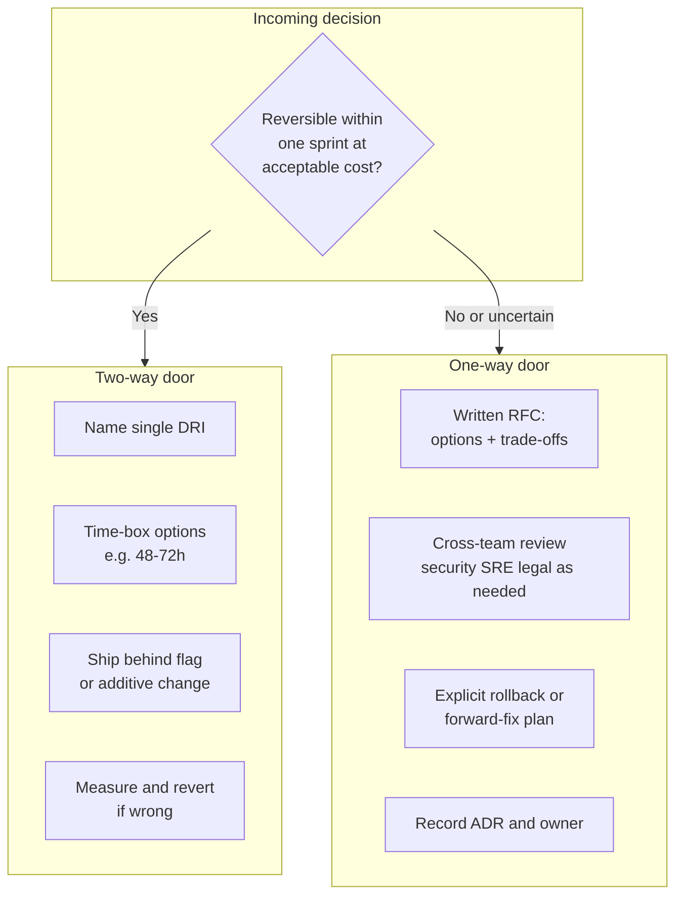

# Decision Making — One-Way vs Two-Way Doors

**Supports decision:** How much process, review, and rollback design a decision deserves before commit.

**Caption:** Two-way doors optimize for **learning speed**; one-way doors optimize for **wrong-direction cost** (data loss, public API breakage, vendor lock-in, regulatory exposure).

**Examples**

| Two-way | One-way |
|---------|---------|
| Feature flag for new checkout step | Choosing primary payment PSP for 3 years |
| Add optional JSON field to event | Delete column with no backfill plan |
| Pilot team uses new cache library | Commit to multi-region active-active for orders |
